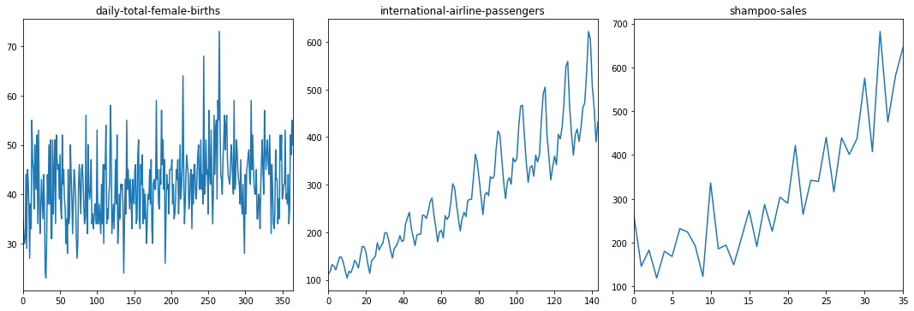
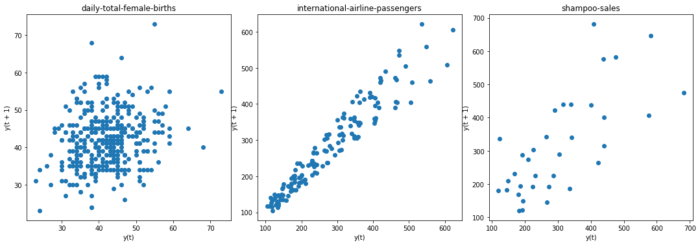
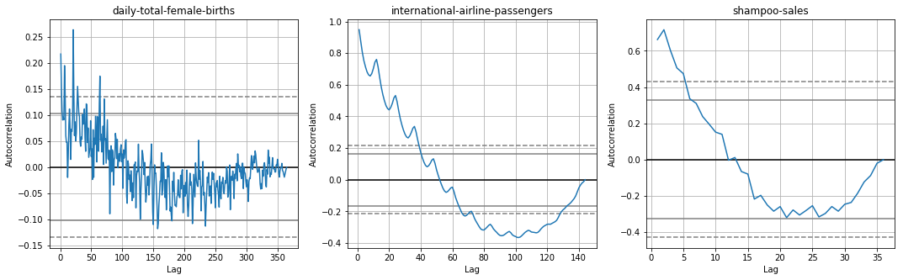
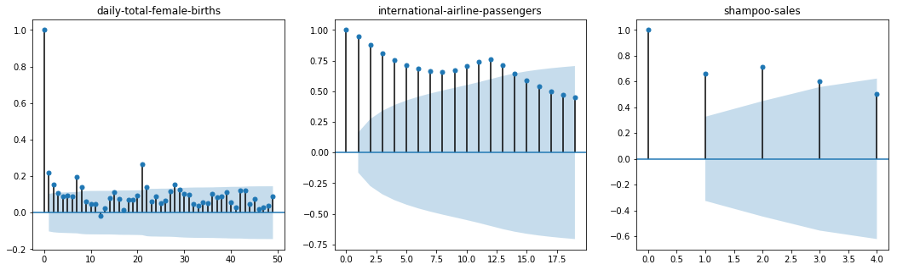
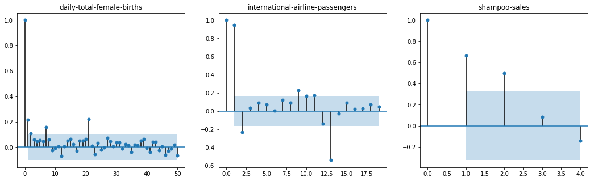
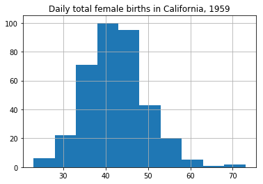
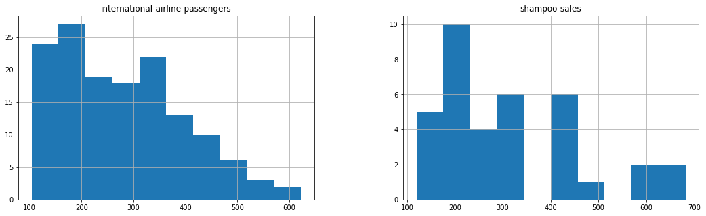
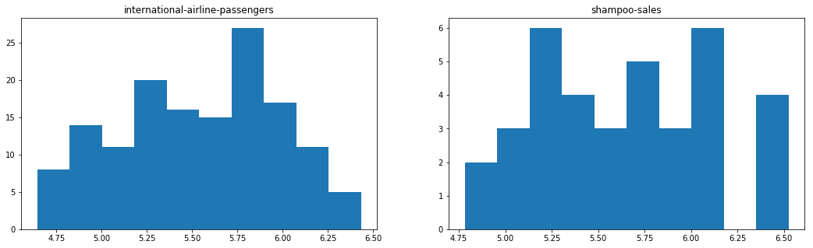

# How to Check if Time Series Data is Stationary with Python


### Introduction

Time series is different from more traditional classification and regression predictive modeling problems.

The temporal structure adds an order to the observations. This imposed order means that important assumptions about the consistency of those observations needs to be handled specifically.

For example, when modeling, there are assumptions that the summary statistics of observations are consistent. In time series terminology, we refer to this expectation as the time series being stationary.

These assumptions can be easily violated in time series by the addition of a trend, seasonality, and other time-dependent structures.

If we fit a stationary model to data, we assume our data are a realization of a stationary process. So our first step in an analysis should be to check whether there is any evidence of a trend or seasonal effects and, if there is, remove them.

After completing this tutorial, you will know:

- How to identify obvious stationary and non-stationary time series using line plot.
- How to spot check summary statistics like mean and variance for a change over time.
- How to use statistical tests with statistical significance to check if a time series is stationary.


```
import sys
import pandas

print('Python version ' + sys.version)
print('Pandas version ' + pandas.__version__)
```

    Python version 3.5.2 | packaged by conda-forge | (default, Jan 19 2017, 15:41:23) [MSC v.1900 64 bit (AMD64)]
    Pandas version 0.20.1
    

### Methods of Checking Stationarity

There are many methods to check whether a time series (direct observations, residuals, otherwise) is stationary or non-stationary.

- Look at Plots: You can review a time series plot of your data and visually check if there are any obvious trends or seasonality.
- Summary Statistics: You can review the summary statistics for your data for seasons or random partitions and check for obvious or significant differences.
- Statistical Tests: You can use statistical tests to check if the expectations of stationarity are met or have been violated.

### Stationary Time Series

The observations in a stationary time series are not dependent on time.

Time series are stationary if they do not have trend or seasonal effects. Summary statistics calculated on the time series are consistent over time, like the mean or the variance of the observations.

When a time series is stationary, it can be easier to model. Statistical modeling methods assume or require the time series to be stationary to be effective.

Below is an example of the Daily Female Births https://datamarket.com/data/set/235k/daily-total-female-births-in-california-1959 dataset that is stationary.

### Non-Stationary Time Series

Observations from a non-stationary time series show seasonal effects, trends, and other structures that depend on the time index.

Summary statistics like the mean and variance do change over time, providing a drift in the concepts a model may try to capture.

Classical time series analysis and forecasting methods are concerned with making non-stationary time series data stationary by identifying and removing trends and removing stationary effects.

Below is an example of the Airline Passengers dataset that is non-stationary, showing both trend and seasonal components.


```
from pandas import Series
from pandas import read_csv
from pandas import datetime
from sklearn.metrics import mean_squared_error
from math import sqrt
import matplotlib.pyplot as plt
from sklearn.preprocessing import MinMaxScaler

# series = Series.from_csv('daily-total-female-births-in-cal.csv', header=0)
# series.plot()

filename1 = 'daily-total-female-births-in-cal.csv'
filename2 = 'international-airline-passengers.csv'
filename3 = 'shampoo-sales.csv'

skipfooter = 2

series1 = read_csv(filename1, usecols=[1], engine='python', skipfooter=skipfooter)
series2 = read_csv(filename2, usecols=[1], engine='python', skipfooter=skipfooter)
series3 = read_csv(filename3, usecols=[1], engine='python', skipfooter=skipfooter)

data1 = series1.values
data1 = data1.astype('float32')

data2 = series2.values
data2 = data2.astype('float32')

data3 = series3.values
data3 = data3.astype('float32')

feature_range = (0, 1)
scaler = MinMaxScaler(feature_range)

scaled_data1 = scaler.fit_transform(data1)
scaled_data2 = scaler.fit_transform(data2)
scaled_data3 = scaler.fit_transform(data3)

f1, (ax1, ax2, ax3) = plt.subplots(1, 3, figsize=(15, 5))
f1.tight_layout()

#ax1.plot(scaled_data1)
#ax1.set_title('daily-total-female-births', fontsize=15)
#ax2.plot(scaled_data2)
#ax2.set_title('international-airline-passengers', fontsize=15)
#ax3.plot(scaled_data3)
#ax3.set_title('shampoo-saless', fontsize=15)

series1.plot(subplots=True, ax=ax1, legend=False, sharex=False, sharey=False)
ax1.set_title('daily-total-female-births')

series2.plot(subplots=True, ax=ax2, legend=False, sharex=False, sharey=False)
ax2.set_title('international-airline-passengers')

series3.plot(subplots=True, ax=ax3, legend=False, sharex=False, sharey=False)
ax3.set_title('shampoo-sales')

plt.show()
```





###  Check if a data set or time series is random by Lag Plot
Lag plots are used to check if a data set or time series is random. Random data should not exhibit any structure in the lag plot. Non-random structure implies that the underlying data are not random.


```
from pandas.plotting import lag_plot
   
f2, (ax4, ax5, ax6) = plt.subplots(1, 3, figsize=(15, 5))
f2.tight_layout()

lag_plot(series1, ax=ax4)
ax4.set_title('daily-total-female-births');

lag_plot(series2, ax=ax5)
ax5.set_title('international-airline-passengers');

lag_plot(series3, ax=ax6)
ax6.set_title('shampoo-sales');

plt.show()

```





### Checking randomness in time series using auto-correlation plot of Pandas
Autocorrelation plots are often used for checking randomness in time series. This is done by computing autocorrelations for data values at varying time lags. If time series is random, such autocorrelations should be near zero for any and all time-lag separations. If time series is non-random then one or more of the autocorrelations will be significantly non-zero. The horizontal lines displayed in the plot correspond to 95% and 99% confidence bands. The dashed line is 99% confidence band.


```
from pandas.plotting import autocorrelation_plot

f3, (ax7, ax8, ax9) = plt.subplots(1, 3, figsize=(18, 5))
#f3.tight_layout()

autocorrelation_plot(series1, ax=ax7)
ax7.set_title('daily-total-female-births');

autocorrelation_plot(series2, ax=ax8)
ax8.set_title('international-airline-passengers');

autocorrelation_plot(series3, ax=ax9)
ax9.set_title('shampoo-sales');

plt.show()

```





### Correlation and Autocorrelation by Statsmodels Library

Statistical correlation summarizes the strength of the relationship between two variables.

We can assume the distribution of each variable fits a Gaussian (bell curve) distribution. If this is the case, we can use the **Pearson correlation coefficient** to summarize the correlation between the variables.

The Pearson correlation coefficient is a number between -1 and 1 that describes a negative or positive correlation respectively. A value of zero indicates no correlation.

We can calculate the correlation for time series observations with observations with previous time steps, called **lags**. Because the correlation of the time series observations is calculated with values of the same series at previous times, this is called a **serial correlation**, or an **autocorrelation**.

A plot of the autocorrelation of a time series by lag is called the **AutoCorrelation Function**, or the acronym **ACF**. This plot is sometimes called a **correlogram** or an **autocorrelation plot**.

Below is an example of calculating and plotting the autocorrelation plot for the Minimum Daily Temperatures using the **plot_acf()** function from the **statsmodels** library.


```
from statsmodels.graphics.tsaplots import plot_acf

f1, (ax1, ax2, ax3) = plt.subplots(1, 3, figsize=(18, 5))
#f3.tight_layout()

plot_acf(series1, ax=ax1, lags = range(0,50))
ax1.set_title('daily-total-female-births')

plot_acf(series2, ax=ax2, lags = range(0, 20))
ax2.set_title('international-airline-passengers')

plot_acf(series3, ax=ax3, lags = range(0, 5))     # note that max lags is 35
ax3.set_title('shampoo-sales')

plt.show()
```





Running the example creates a 2D plot showing the lag value along the x-axis and the correlation on the y-axis between -1 and 1.

Confidence intervals are drawn as a cone. By default, this is set to a 95% confidence interval, suggesting that correlation values outside of this code are very likely a correlation and not a statistical fluke.

By default, all lag values are printed, which makes the plot noisy.

We can limit the number of lags on the x-axis to 50, 20, 5 respectively to make the plots easier to read.

### Partial Autocorrelation Function

A partial autocorrelation is a summary of the relationship between an observation in a time series with observations at prior time steps with the relationships of intervening observations removed.

The autocorrelation for an observation and an observation at a prior time step is comprised of both the direct correlation and indirect correlations. These indirect correlations are a linear function of the correlation of the observation, with observations at intervening time steps.

It is these indirect correlations that the partial autocorrelation function seeks to remove. Without going into the math, this is the intuition for the partial autocorrelation.

The example below calculates and plots a partial autocorrelation function for the first 50 lags in the Minimum Daily Temperatures dataset using the **plot_pacf()** from the statsmodels library.


```
from statsmodels.graphics.tsaplots import plot_pacf

f1, (ax1, ax2, ax3) = plt.subplots(1, 3, figsize=(18, 5))
#f3.tight_layout()

plot_pacf(series1, ax=ax1, lags = 50)
ax1.set_title('daily-total-female-births')

plot_pacf(series2, ax=ax2, lags = range(0, 20))
ax2.set_title('international-airline-passengers')

plot_pacf(series3, ax=ax3, lags = range(0, 5))
ax3.set_title('shampoo-sales')

plt.show()
```





#### Autoregression Intuition

Consider a time series that was generated by an autoregression (AR) process with a lag of k.

We know that the ACF describes the autocorrelation between an observation and another observation at a prior time step that includes direct and indirect dependence information.

This means we would expect the ACF for the AR(k) time series to be strong to a lag of k and the inertia of that relationship would carry on to subsequent lag values, trailing off at some point as the effect was weakened.

We know that the PACF only describes the direct relationship between an observation and its lag. This would suggest that there would be no correlation for lag values beyond k.

This is exactly the expectation of the ACF and PACF plots for an AR(k) process.

### Checking Stationality by Summary Statistics

A quick and dirty check to see if your time series is non-stationary is to review summary statistics.

You can split your time series into two (or more) partitions and compare the mean and variance of each group. If they differ and the difference is statistically significant, the time series is likely non-stationary.


```
# Plot histogram
series1.hist()
plt.show()
```





Running the example plots a histogram of values from the time series. We clearly see the bell curve-like shape of the Gaussian distribution, perhaps with a longer right tail.

Next, we can split the time series into two contiguous sequences. We can then calculate the mean and variance of each group of numbers and compare the values.


```
X = series1.values
split = int(len(X) / 2)
X1, X2 = X[0:split], X[split:]
mean1, mean2 = X1.mean(), X2.mean()
var1, var2 = X1.var(), X2.var()
print('mean1=%.2f, mean2=%.2f' % (mean1, mean2))
print('variance1=%.2f, variance2=%.2f' % (var1, var2))
```

    mean1=39.76, mean2=44.19
    variance1=49.21, variance2=48.71
    

Running this example shows that the mean and variance values are different, but in the same ball-park

Next, let's try the same trick on the Airline Passengers and Shampoo Sales dataset.

#### Airline Passengers and Shampoo Sales Dataset

Cutting straight to the chase, we can split our dataset and calculate the mean and variance for each group.


```

X = series2.values    # Airline passgengers dataset
split = int(len(X) / 2)
X1, X2 = X[0:split], X[split:]
mean1, mean2 = X1.mean(), X2.mean()
var1, var2 = X1.var(), X2.var()
print('mean1=%.2f, mean2=%.2f' % (mean1, mean2))
print('variance1=%.2f, variance2=%.2f\n' % (var1, var2))

X = series3.values    # Shampoo Sales dataset
split = int(len(X) / 2)
X1, X2 = X[0:split], X[split:]
mean1, mean2 = X1.mean(), X2.mean()
var1, var2 = X1.var(), X2.var()
print('mean1=%.2f, mean2=%.2f' % (mean1, mean2))
print('variance1=%.2f, variance2=%.2f' % (var1, var2))
```

    mean1=182.90, mean2=377.69
    variance1=2244.09, variance2=7367.96
    
    mean1=203.51, mean2=421.69
    variance1=3187.75, variance2=16141.27
    

Running the example, we can see the mean and variance look very different.

So we have a non-stationary time series.

Well, maybe.

Let's take one step back and check if assuming a Gaussian distribution makes sense in this case by plotting the values of the time series as a histogram.


```
f4, (ax10, ax11) = plt.subplots(1, 2, figsize=(18, 5))
#f4.tight_layout()

#series2.hist(ax10)
series2.hist(ax=ax10)
ax10.set_title('international-airline-passengers')

series3.hist(ax=ax11)
ax11.set_title('shampoo-sales');

plt.show()
```





Running the examples above shows that indeed the distribution of values does not look like a Gaussian, therefore the mean and variance values are less meaningful.

This squashed distribution of the observations may be another indicator of a non-stationary time series.

Reviewing the plot of the time series again, we can see that there is an obvious seasonality component, and it looks like the seasonality component is growing.

This may suggest an exponential growth from season to season. A log transform can be used to flatten out exponential change back to a linear relationship.

Below is the same histogram with a log transform of the time series.

Running the example, we can see the more familiar Gaussian-like or Uniform-like distribution of values.

We also create a line plot of the log transformed data and can see the exponential growth seems diminished, but we still have a trend and seasonal elements


```
X2 = series2.values
X2 = log(X2)

X3 = series3.values
X3 = log(X3)

f5, (ax12, ax13) = plt.subplots(1, 2, figsize=(18, 5))

ax12.hist(X2)
ax12.set_title('international-airline-passengers')

ax13.hist(X3)
ax13.set_title('shampoo-sales');

plt.show()

```





We can now calculate the mean and standard deviation of the values of the log transformed dataset.


```
X = series2.values
X = log(X)
split = int(len(X) / 2)
X1, X2 = X[0:split], X[split:]
mean1, mean2 = X1.mean(), X2.mean()
var1, var2 = X1.var(), X2.var()
print('international-airline-passengers:')
print('mean1=%f, mean2=%f' % (mean1, mean2))
print('variance1=%.2f, variance2=%.2f' % (var1, var2))
```

    international-airline-passengers:
    mean1=5.175146, mean2=5.909206
    variance1=0.07, variance2=0.05
    

Running the examples shows mean and standard deviation values for each group that are again similar, but not identical.

Perhaps, from these numbers alone, we would say the time series is stationary, but we strongly believe this to not be the case from reviewing the line plot.

This is a quick and dirty method that may be easily fooled.

We can use a statistical test to check if the difference between two samples of Gaussian random variables is real or a statistical fluke. We could explore statistical significance tests, like the Student t-test, but things get tricky because of the serial correlation between values.

In the next section, we will use a statistical test designed to explicitly comment on whether a univariate time series is stationary.

In addition to log transformation, we can also try difference-transformation to remove the trend in the original dataset.

### Checking Stationality by Augmented Dickey-Fuller test

Statistical tests make strong assumptions about your data. They can only be used to inform the degree to which a null hypothesis can be accepted or rejected. The result must be interpreted for a given problem to be meaningful.

Nevertheless, they can provide a quick check and confirmatory evidence that your time series is stationary or non-stationary.

The **Augmented Dickey-Fuller test** is a type of statistical test called a unit root test.

The intuition behind a unit root test is that it determines how strongly a time series is defined by a trend.

There are a number of unit root tests and the Augmented Dickey-Fuller may be one of the more widely used. It uses an autoregressive model and optimizes an information criterion across multiple different lag values.

The **null hypothesis** of the test is that the time series can be represented by a **unit root**, that it is not stationary (has some time-dependent structure). The **alternate hypothesis** (rejecting the null hypothesis) is that the time series is stationary.

**Null Hypothesis (H0)**: If accepted, it suggests the time series has a unit root, meaning it is non-stationary. It has some time dependent structure.
**Alternate Hypothesis (H1)**: The null hypothesis is rejected; it suggests the time series does not have a unit root, meaning it is stationary. It does not have time-dependent structure.
We interpret this result using the **p-value** from the test. A p-value below a threshold (such as 5% or 1%) suggests we reject the null hypothesis (stationary), otherwise a p-value above the threshold suggests we accept the null hypothesis (non-stationary).

- p-value > 0.05: Accept the null hypothesis (H0), the data has a unit root and is non-stationary.
- p-value <= 0.05: Reject the null hypothesis (H0), the data does not have a unit root and is stationary.

For example, if p-value = 0.2924, it means that null hypothesis will be rejected only around 30% which is quite a high considering the traditional level of significance (1%, 5%, and 10%).

Below is an example of calculating the Augmented Dickey-Fuller test on the Daily Female Births dataset. The statsmodels library provides the **adfuller()** function that implements the test.


```
from pandas import Series
from statsmodels.tsa.stattools import adfuller

#series = Series.from_csv('daily-total-female-births-in-cal.csv', header=0)
#series = series[0:-1]

#X1 = series1.values
#X1 = X1.flatten()

P_result1 = adfuller(data1.flatten())
P_result2 = adfuller(data2.flatten())
P_result3 = adfuller(data3.flatten())

print("               daily-total-female-births   international-airline-passengers   shampoo-sales")
print('ADF Statistic:           %f                       %f                %f' % (P_result1[0], P_result2[0], P_result3[0]))
print('p-value:                 %f                        %f                %f' % (P_result1[1], P_result2[1], P_result3[1]))

print('Critical Values:')

names = []
for name, number in P_result1[4].items():
    names.append(name)
    
for i in range(len(names)):
    value1 = P_result1[4][names[i]]
    value2 = P_result2[4][names[i]]
    value3 = P_result3[4][names[i]]  
    print('            {0:2s}:          {1:.4f}                         {1:.4f}                 {1:.4f}'.format(names[i], value1, value2, value3))
```

                   daily-total-female-births   international-airline-passengers   shampoo-sales
    ADF Statistic:           -4.808291                       0.815369                3.060143
    p-value:                 0.000052                        0.991880                1.000000
    Critical Values:
                1%:          -3.4487                         -3.4487                 -3.4487
                5%:          -2.8696                         -2.8696                 -2.8696
                10%:          -2.5711                         -2.5711                 -2.5711
    

Running the example prints the test statistic value of -4.8. The more negative this statistic, the more likely we are to reject the null hypothesis (we have a stationary dataset).

As part of the output, we get a look-up table to help determine the ADF statistic. We can see that our statistic value of -4.8 is less than the value of -3.449 at 1%.

This suggests that we can reject the null hypothesis with a significance level of less than 1% (i.e. a low probability that the result is a statistical fluke).

Rejecting the null hypothesis means that the process has no unit root, and in turn that the time series is stationary or does not have time-dependent structure.

We can perform the same test on the Airline Passenger dataset.

Running the example gives a different picture than the above. The test statistic is positive, meaning we are much less likely to reject the null hypothesis (it looks non-stationary).

Comparing the test statistic to the critical values, it looks like we would have to accept the null hypothesis that the time series is non-stationary and does have time-dependent structure.


Let's **log transform** the dataset again to make the distribution of values more linear and better meet the expectations of this statistical test.

Jiyang's notes: if the trend of a time series is exponential, transforming it to log values may eliminate the trend.


Jiyang's note: p-value gets much smaller (half of previous) by log-transformation but is still much larger than 0.05, which suggests to accept null hypothesis (non-stationary). This is contradictive to the result of ADF statistic value.


```
from numpy import log

data2_log = log(data2)
result = adfuller(data2_log.flatten())    # faltten() opens the array into list of values that adfuller() requires
print('Airline passengers:\nADF Statistic: %f' % result[0])
print('p-value: %f' % result[1])
for key, value in result[4].items():
    print('\t%s: %.3f' % (key, value))

data3_log = log(data3)
result = adfuller(data3_log.flatten())    # faltten() opens the array into list of values that adfuller() requires
print('\nShampoo sales:\nADF Statistic: %f' % result[0])
print('p-value: %f' % result[1])
for key, value in result[4].items():
    print('\t%s: %.3f' % (key, value))
```

    Airline passengers:
    ADF Statistic: -1.717017
    p-value: 0.422367
    	1%: -3.482
    	5%: -2.884
    	10%: -2.579
    
    Shampoo sales:
    ADF Statistic: 1.798461
    p-value: 0.998346
    	1%: -3.724
    	5%: -2.986
    	10%: -2.633
    

We can see that the ADF value of Airline passgengers is still larger than the critical values, again, meaning that we can accept the null hypothesis and in turn that the time series is non-stationary even though it becomes less likely than before log transformation.

It seems that log transformation over shampoo sales does not remove the trend because both ADF Statistics > 0 and P-value > 0.05.
A p-value more than the critical value means we cannot reject H0, we accept that there is a unit root and that the data is non-stationary.

But...

We turn to machine learning methods when the classical methods fail. When we want more or better results. We cannot know how to best model unknown nonlinear relationships in time series data and some methods may result in better performance when working with non-stationary observations or some mixture of stationary and non-stationary views of the problem.

The suggestion here is to treat properties of a time series being stationary or not as another source of information that can be used in feature engineering and feature selection on your time series problem when using machine learning methods.


```

```
